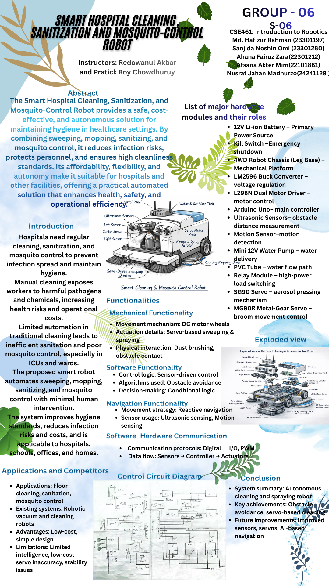
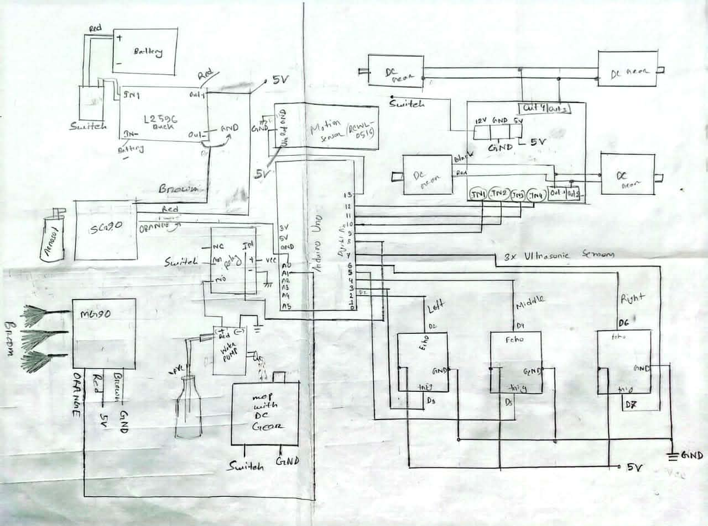

# Smart Hospital Cleaning, Sanitization & Mosquito-Control Robot 🤖

**Autonomous Arduino-based robot** for automated floor cleaning, surface sanitization, and mosquito control in healthcare settings.

**Course**: CSE461 – Introduction to Robotics, BRAC University (Fall 2025)  
**Group 06**: Afsana Akter Mim • Ahana Fairuz Zara • Nusrat Jahan Madhurzo • Md. Hafizur Rahman • Sanjida Noshin Omi

### Project Highlights
- Obstacle avoidance with 3× HC-SR04 ultrasonic sensors
- Servo-driven sweeping brush (MG90)
- Safe sanitizer/mosquito aerosol spraying (SG90 + relay pump, pauses on motion detection)
- 4WD chassis navigation with reactive logic

### Visuals
 <!-- Your poster image -->

 <!-- Actual build photo -->

 <!-- Hand-drawn schematic -->

<video controls width="100%">
  <source src="Hardware-project/demo-video.mp4" type="video/mp4">
  Your browser does not support the video tag.
</video>


### Arduino Code (C++)
Main control sketch for navigation, sweeping, and safe spraying.

```cpp
#include <Servo.h>

// Pin definitions...
#define IN1 9
// #include <Servo.h>

#define IN1 9
#define IN2 10
#define IN3 11
#define IN4 12

#define TRIG_LEFT 3
#define ECHO_LEFT 2
#define TRIG_MID 5
#define ECHO_MID 4
#define TRIG_RIGHT 7
#define ECHO_RIGHT 6

#define RELAY_PIN 8
#define MOTION_PIN 13


#define SERVO_SG90 A0     
#define SERVO_MG90 A1     

#define SPRAY_PRESS   40
#define SPRAY_RELEASE 90
Servo sg90;
Servo mg90;
long getDistance(int trig, int echo) {
  digitalWrite(trig, LOW);
  delayMicroseconds(2);
  digitalWrite(trig, HIGH);
  delayMicroseconds(10);
  digitalWrite(trig, LOW);

  long duration = pulseIn(echo, HIGH, 30000);
  if (duration == 0) return 300;
  return duration * 0.034 / 2;
}


void forward() {
  digitalWrite(IN1, HIGH); digitalWrite(IN2, LOW);
  digitalWrite(IN3, HIGH); digitalWrite(IN4, LOW);
}

void backward() {
  digitalWrite(IN1, LOW); digitalWrite(IN2, HIGH);
  digitalWrite(IN3, LOW); digitalWrite(IN4, HIGH);
}

void turnLeft() {
  digitalWrite(IN1, LOW); digitalWrite(IN2, LOW);
  digitalWrite(IN3, HIGH); digitalWrite(IN4, LOW);
}

void turnRight() {
  digitalWrite(IN1, HIGH); digitalWrite(IN2, LOW);
  digitalWrite(IN3, LOW); digitalWrite(IN4, LOW);
}

void stopMotors() {
  digitalWrite(IN1, LOW); digitalWrite(IN2, LOW);
  digitalWrite(IN3, LOW); digitalWrite(IN4, LOW);
}
void sprayOnceSafe() {
  stopMotors();
  digitalWrite(RELAY_PIN, LOW);
  delay(200);                  
  sg90.write(SPRAY_PRESS);
  delay(150);                  
  sg90.write(SPRAY_RELEASE);
  delay(350);                 
}


void sweepMG90() {

  // Left to Right
  for (int angle = 30; angle <= 150; angle++) {
    mg90.write(angle);
    delay(10);
  }

  // Right to Left
  for (int angle = 150; angle >= 30; angle--) {
    mg90.write(angle);
    delay(10);
  }
}
void setup() {

  pinMode(IN1, OUTPUT); pinMode(IN2, OUTPUT);
  pinMode(IN3, OUTPUT); pinMode(IN4, OUTPUT);
  pinMode(TRIG_LEFT, OUTPUT);  pinMode(ECHO_LEFT, INPUT);
  pinMode(TRIG_MID, OUTPUT);   pinMode(ECHO_MID, INPUT);
  pinMode(TRIG_RIGHT, OUTPUT); pinMode(ECHO_RIGHT, INPUT);

  pinMode(RELAY_PIN, OUTPUT);
  pinMode(MOTION_PIN, INPUT);
  sg90.attach(SERVO_SG90);
  sg90.write(SPRAY_RELEASE);

  mg90.attach(SERVO_MG90);
  mg90.write(90);

  digitalWrite(RELAY_PIN, LOW); // Pump OFF
}


void loop() {

  // Always try to move forward
  forward();

  // Read distances
  long dLeft  = getDistance(TRIG_LEFT, ECHO_LEFT);
  long dMid   = getDistance(TRIG_MID, ECHO_MID);
  long dRight = getDistance(TRIG_RIGHT, ECHO_RIGHT);

  // Servo sweep ONLY occasionally (non-critical)
  static unsigned long lastSweep = 0;
  if (millis() - lastSweep > 2000) {
    sweepMG90();
    lastSweep = millis();
  }

  // Motion detected → spray but resume movement
  if (digitalRead(MOTION_PIN) == HIGH) {
    sprayOnceSafe();
    forward();           
  }

  // Obstacle avoidance
  if (dMid < 25) {
    backward();
    delay(200);

    if (dLeft > dRight) turnLeft();
    else turnRight();

    delay(200);
    forward();           
  }
}

